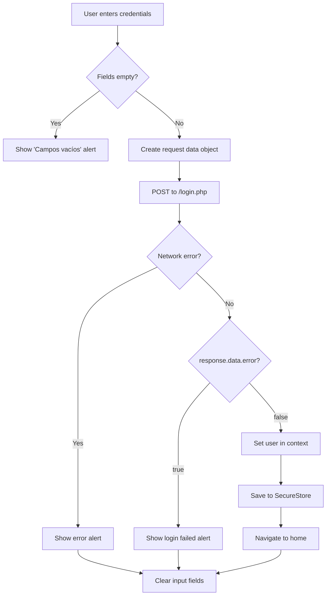

## Overview

BioTea implements a secure authentication flow that validates user credentials, stores authentication data securely using Expo's SecureStore, and navigates to the home screen upon successful login.

## Authentication Flow Steps

### Step 1: User Input Collection

The login screen (`app/login.tsx`) collects user credentials through controlled TextInput components:

<CodeGroup>
```javascript State Management
const [username, setUsername] = useState('');
const [password, setPassword] = useState('');
```

```jsx UI Components
<TextInput
  style={styles.input}
  placeholder="Username"
  value={username}
  onChangeText={setUsername}
  autoCapitalize="none"
/>
<TextInput
  style={styles.input}
  placeholder="Password"
  value={password}
  onChangeText={setPassword}
  secureTextEntry
/>
```
</CodeGroup>

### Step 2: Client-Side Validation

Before making the API request, the app validates that both fields are populated:

```javascript app/login.tsx:18-21
if (username === '' || password === '') {
  Alert.alert('Campos vacíos', 'Por favor, complete todos los campos.');
  return;
}
```

<Note>
  This prevents unnecessary API calls and provides immediate feedback to users.
</Note>

### Step 3: API Request

The app sends a POST request to the login endpoint using axios:

```javascript app/login.tsx:24-32
const requestData = {
  user: username,
  pass: password,
};

const response = await axios.post(
  `${apiEndpoints.dev}/login.php`,
  requestData
);
```

**Request Structure:**
- **Endpoint:** `https://simulacion7sb.000webhostapp.com/api/login.php`
- **Method:** POST
- **Body:** `{ user: string, pass: string }`

### Step 4: Response Handling

The API response is evaluated based on the `error` field:

#### Success Path (`error: false`)

When authentication succeeds:

```javascript app/login.tsx:34-38
if (!response.data.error) {
  // Update global user context
  setUser(response.data.data);
  
  // Store user data securely
  await saveSecureData('user', response.data.data);
  
  // Navigate to home screen
  router.navigate('(tabs)/(home)/inic');
}
```

**Actions performed:**
1. User data is set in the global UserContext via `setUser()`
2. User data is persisted to secure storage using `saveSecureData()`
3. Navigation to the home tab screen at `(tabs)/(home)/inic`

#### Error Path (`error: true`)

When authentication fails:

```javascript app/login.tsx:40-42
else {
  Alert.alert(
    'Inicio de sesión fallido', 
    response.data.message || "Datos incorrectos, por favor revise su información de inicio de sesión"
  );
}
```

An alert is shown with the server-provided error message or a default fallback message.

### Step 5: Exception Handling

Network errors and other exceptions are caught and displayed to the user:

```javascript app/login.tsx:43-45
catch (error) {
  console.log(error);
  Alert.alert('Error', 'Hubo un error al intentar iniciar sesión. Por favor, inténtelo de nuevo más tarde.');
}
```

<Warning>
  Network failures, timeouts, or server errors trigger this catch block. The error is logged to the console for debugging.
</Warning>

### Step 6: Cleanup

Regardless of success or failure, input fields are cleared:

```javascript app/login.tsx:46-50
finally {
  // Clear input fields after login attempt
  setUsername('');
  setPassword('');
}
```

## Complete Flow Diagram



## Security Considerations

### Secure Storage

User data is stored using Expo's SecureStore API through the `SecureStoreContext`:

```javascript
await saveSecureData('user', response.data.data);
```

This ensures sensitive user information is encrypted at rest on the device.

### Context Management

The app uses React Context (`UserContext`) to provide user data globally:

```javascript app/login.tsx:6,14
import { useUser } from '../components/UserContext';
const { setUser } = useUser();
```

This allows authenticated state to be accessed throughout the application without prop drilling.

## Dependencies

- **axios**: HTTP client for API requests
- **expo-router**: Navigation and routing
- **UserContext**: Global user state management
- **SecureStoreContext**: Encrypted storage wrapper

## Implementation Reference

Complete authentication handler: `app/login.tsx:17-51`