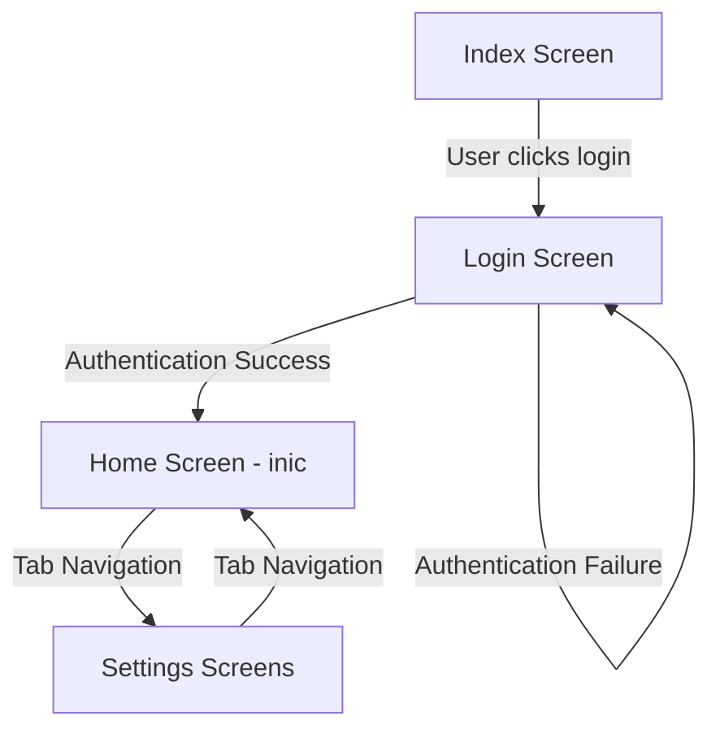

## Routing Overview

BioTea uses **expo-router**, a file-based routing system that automatically generates navigation structure from the `app/` directory layout. This approach eliminates manual route configuration and provides type-safe navigation.

<Info>
  Expo Router is built on top of React Navigation, providing a declarative routing API where the file system defines the navigation structure.
</Info>

## File-Based Routing Conventions

### Core Concepts

<CardGroup cols={2}>
  <Card title="File = Route" icon="file">
    Every file in `app/` becomes a route
    - `app/login.tsx` → `/login`
    - `app/index.tsx` → `/`
  </Card>
  <Card title="Folder = Segment" icon="folder">
    Folders create URL segments
    - `app/settings/user.tsx` → `/settings/user`
  </Card>
  <Card title="_layout.tsx" icon="layer-group">
    Special files define navigation containers
    - Stack, Tab, or Drawer navigators
  </Card>
  <Card title="(groups)" icon="object-group">
    Parentheses create route groups without affecting URLs
    - `app/(tabs)/home.tsx` → `/home`
  </Card>
</CardGroup>

### Special File Names

| File Name | Purpose | Example |
|-----------|---------|----------|
| `_layout.tsx` | Defines navigation container for child routes | `app/_layout.tsx` |
| `index.tsx` | Default route for a directory | `app/index.tsx` → `/` |
| `[param].tsx` | Dynamic route segment | `app/user/[id].tsx` → `/user/:id` |
| `(group)` | Route group (doesn't affect URL) | `app/(tabs)/home.tsx` → `/home` |

## BioTea Navigation Structure

### Complete Route Tree

```
/ (Root Stack Navigator)
├── / (index.tsx)
│   └── Welcome screen
│
├── /login (login.tsx)
│   └── Authentication screen
│
├── /register (register.tsx)
│   └── Registration screen
│
└── /(tabs) (Tab Navigator)
    │
    ├── /(home) (Stack Navigator)
    │   └── /inic (inic.tsx)
    │       └── Home screen
    │
    └── /(settings) (Stack Navigator)
        ├── /settingsG (settingsG.tsx)
        │   └── Settings main
        ├── /general (general.tsx)
        │   └── General settings
        ├── /notification (notification.tsx)
        │   └── Notification settings
        └── /user (user.tsx)
            └── User profile
```

## Navigation Implementations

### Root Layout - Stack Navigator

**Location**: `app/_layout.tsx`

The root layout establishes the foundational navigation structure and wraps the app with context providers.

<Accordion title="Root Layout Implementation">
  ```tsx
  import { Stack } from "expo-router";
  import { UserProvider } from "../components/UserContext";
  import { SecureStoreProvider } from "../components/SecureStoreContext";

  export default function RootLayout() {
    return (
      <UserProvider>
        <SecureStoreProvider>
          <Stack
            screenOptions={{
              headerStyle: {
                backgroundColor: '#f4511e',
              },
              headerTintColor: '#fff',
              headerTitleStyle: {
                fontWeight: 'bold',
              },
            }}
          >
            <Stack.Screen name="index" options={{ title: 'BioTea App', headerShown: true }} />
            <Stack.Screen name="login" />
            <Stack.Screen name="register" />
            <Stack.Screen name="(tabs)" options={{ headerShown: false }} />
          </Stack>
        </SecureStoreProvider>
      </UserProvider>
    );
  }
  ```
  
  **Key Features**:
  - Context providers wrap the entire navigation tree
  - Consistent header styling across all stack screens
  - Header hidden for tab navigator to avoid duplication
  - Custom title for index screen
</Accordion>

### Tab Navigator

**Location**: `app/(tabs)/_layout.tsx`

Implements the main application interface with two tabs: Home and Settings.

<Accordion title="Tab Navigator Implementation">
  ```tsx
  import FontAwesome from '@expo/vector-icons/FontAwesome';
  import { Tabs } from 'expo-router';

  export default function TabLayout() {
    return (
      <Tabs screenOptions={{ tabBarActiveTintColor: 'blue' }}>
        <Tabs.Screen
          name="(home)"
          options={{
            title: 'Home',
            tabBarIcon: ({ color }) => <FontAwesome size={28} name="home" color={color} />,
          }}
        />
        <Tabs.Screen
          name="(settings)"
          options={{
            title: 'Settings',
            tabBarIcon: ({ color }) => <FontAwesome size={28} name="cog" color={color} />,
          }}
        />
      </Tabs>
    );
  }
  ```
  
  **Key Features**:
  - Two tabs with FontAwesome icons
  - Active tab highlighted in blue
  - Route groups `(home)` and `(settings)` keep URLs clean
  - Each tab contains its own Stack navigator
</Accordion>

### Nested Stack Navigators

Both tabs contain nested Stack navigators for managing multiple screens within each tab.

<Accordion title="Home Stack Navigator">
  **Location**: `app/(tabs)/(home)/_layout.tsx`
  
  ```tsx
  import { Stack } from "expo-router";

  export default function RootLayout() {
    return (
      <Stack
        screenOptions={{
          headerStyle: { backgroundColor: '#f4511e' },
          headerTintColor: '#fff',
          headerTitleStyle: { fontWeight: 'bold' },
        }}
      >
        <Stack.Screen
          name="inic"
          options={{ title: 'BioTea App', headerShown: false }}
        />
      </Stack>
    );
  }
  ```
  
  **Screens**:
  - `inic.tsx` - Main home screen (authenticated users land here after login)
</Accordion>

<Accordion title="Settings Stack Navigator">
  **Location**: `app/(tabs)/(settings)/_layout.tsx`
  
  ```tsx
  import { Stack } from "expo-router";

  export default function RootLayout() {
    return (
      <Stack
        screenOptions={{
          headerStyle: { backgroundColor: '#f4511e' },
          headerTintColor: '#fff',
          headerTitleStyle: { fontWeight: 'bold' },
        }}
      >
        <Stack.Screen name="settingsG" options={{ title: 'BioTea App', headerShown: false }} />
        <Stack.Screen name="general" options={{ title: 'BioTea App', headerShown: false }} />
        <Stack.Screen name="notification" options={{ title: 'BioTea App', headerShown: false }} />
        <Stack.Screen name="user" options={{ title: 'BioTea App', headerShown: false }} />
      </Stack>
    );
  }
  ```
  
  **Screens**:
  - `settingsG.tsx` - Main settings screen
  - `general.tsx` - General app settings
  - `notification.tsx` - Notification preferences
  - `user.tsx` - User profile and account settings
</Accordion>

## Navigation Patterns

### Programmatic Navigation

BioTea uses the `useRouter` hook for programmatic navigation.

<Accordion title="Using useRouter Hook">
  **Example from login.tsx**:
  
  ```tsx
  import { useRouter } from 'expo-router';

  export default function Login() {
    const router = useRouter();
    
    const handleLogin = async () => {
      // Authentication logic...
      if (authenticated) {
        // Navigate to home screen after successful login
        router.navigate('(tabs)/(home)/inic');
      }
    };
    
    return (/* UI */);
  }
  ```
  
  **Common Router Methods**:
  - `router.navigate(path)` - Navigate to a route
  - `router.push(path)` - Push new route onto stack
  - `router.back()` - Go back one screen
  - `router.replace(path)` - Replace current route
</Accordion>

### Declarative Navigation with Link

<Accordion title="Using Link Component">
  **Example from index.tsx**:
  
  ```tsx
  import { Link } from 'expo-router';
  import { TouchableOpacity } from 'react-native';

  export default function Index() {
    return (
      <TouchableOpacity style={styles.button}>
        <Link 
          style={styles.buttonText} 
          href={{ pathname: 'login', params: { name: 'Dato 1' } }}
        >
          Go to Login
        </Link>
      </TouchableOpacity>
    );
  }
  ```
  
  **Features**:
  - Declarative navigation with JSX
  - Support for route parameters
  - Automatic accessibility features
  - Type-safe with typed routes enabled
</Accordion>

## Route Groups Explained

<Note>
  Route groups in expo-router use parentheses `()` to organize routes without affecting the URL structure. This is a powerful feature for logical organization.
</Note>

### Why Route Groups?

**Without Route Groups**:
```
app/tabs/home/inic.tsx → /tabs/home/inic
app/tabs/settings/user.tsx → /tabs/settings/user
```

**With Route Groups**:
```
app/(tabs)/(home)/inic.tsx → /inic
app/(tabs)/(settings)/user.tsx → /user
```

**Benefits**:
1. **Clean URLs**: Groups don't appear in the URL path
2. **Logical Organization**: Group related screens without URL clutter
3. **Shared Layouts**: Each group can have its own `_layout.tsx`
4. **Navigation Separation**: Isolate tab navigation from URL structure

## Authentication Flow

The routing structure supports a typical authentication flow:



<Accordion title="Authentication Navigation Code">
  **From login.tsx**:
  
  ```tsx
  const handleLogin = async () => {
    try {
      const response = await axios.post(
        `${apiEndpoints.dev}/login.php`,
        { user: username, pass: password }
      );

      if (!response.data.error) {
        // Update contexts
        setUser(response.data.data);
        await saveSecureData('user', response.data.data);
        
        // Navigate to authenticated area
        router.navigate('(tabs)/(home)/inic');
      }
    } catch (error) {
      Alert.alert('Error', 'Authentication failed');
    }
  };
  ```
  
  **Key Points**:
  - User data stored in both Context (runtime) and SecureStore (persistent)
  - Navigation occurs after successful data storage
  - Route path reflects nested structure: `(tabs)/(home)/inic`
</Accordion>

## Screen Options and Headers

### Global Screen Options

Set in root `_layout.tsx` via `screenOptions`:

```tsx
screenOptions={{
  headerStyle: { backgroundColor: '#f4511e' },
  headerTintColor: '#fff',
  headerTitleStyle: { fontWeight: 'bold' },
}}
```

### Per-Screen Options

Override global options for specific screens:

```tsx
<Stack.Screen 
  name="index" 
  options={{ 
    title: 'BioTea App', 
    headerShown: true 
  }} 
/>
```

### Common Options

| Option | Type | Purpose |
|--------|------|----------|
| `title` | string | Screen header title |
| `headerShown` | boolean | Show/hide header |
| `headerStyle` | object | Header container styles |
| `headerTintColor` | string | Header text/icon color |
| `tabBarIcon` | function | Tab bar icon component |

## Type-Safe Routing

BioTea enables typed routes in `app.json`:

```json
"experiments": {
  "typedRoutes": true
}
```

<Info>
  With typed routes enabled, TypeScript automatically generates route types, providing autocomplete and type checking for all navigation calls.
</Info>

**Benefits**:
- Autocomplete for route paths
- Compile-time route validation
- Type-safe route parameters
- Refactoring safety

## Navigation Best Practices

<CardGroup cols={2}>
  <Card title="Use Route Groups" icon="object-group">
    Organize related screens without URL pollution
  </Card>
  <Card title="Consistent Headers" icon="heading">
    Set global styles in root layout, override when needed
  </Card>
  <Card title="Context Integration" icon="sitemap">
    Wrap navigators with providers in root layout
  </Card>
  <Card title="Type Safety" icon="shield-check">
    Enable typedRoutes for compile-time safety
  </Card>
</CardGroup>

## Deep Linking

BioTea is configured for deep linking with the custom scheme `"myapp"`.

**From app.json**:
```json
"scheme": "myapp"
```

**Example Deep Links**:
- `myapp://login` - Opens login screen
- `myapp://user` - Opens user settings

## Common Routing Patterns

### Navigate After Authentication

```tsx
router.navigate('(tabs)/(home)/inic');
```

### Navigate with Parameters

```tsx
<Link href={{ pathname: 'user', params: { id: '123' } }}>
  View Profile
</Link>
```

### Navigate Back

```tsx
router.back();
```

### Replace Current Screen

```tsx
router.replace('login');
```